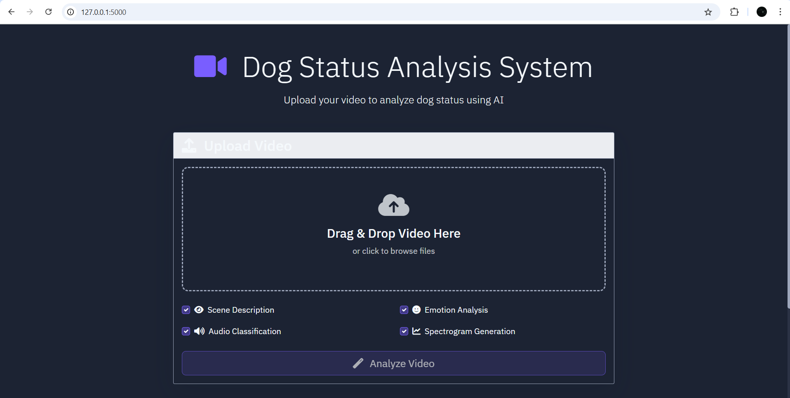

# Introduction
This project is about the dog status inferencer by analyse dog condition through various information from the video using AIs. It helps human to understand the dog's feeling and situation so that they're able to treat symptoms before occur to avoid further deterioration.

# Setup
**Download dependencies**
``` bash
pip download -r requirements.txt
```

**Download dataset**

Download training dataset from [https://www.kaggle.com/datasets/danielshanbalico/dog-emotion]. Put it inside the train folder.
Run the training code block inside ``resnet18Training.ipynb`` to get resnet18 model weight. Drag it outside to the same path with ``DogEmotion.py``.

**Edit path**

***website/app.py:*** line 11 & 12

***website/routes.py:*** line 11

# Execution
1. Open terminal inside website folder and execute command below.
``` bash
python app.py
```

2. Enter ``http://127.0.0.1:5000`` on search engine and the webpage should appear:


# Example
**Example 1**

Video found from YouTube [https://www.youtube.com/watch?v=01le4Ln8da0].
https://github.com/user-attachments/assets/fe70cddc-97e0-4491-b755-7a005c8d35cc

Output


**Example 2**

The video was shot by casually taking photos of dogs encountered while eating with family on the roadside to simulate the real scene.
https://github.com/user-attachments/assets/b46aa029-67bc-49f5-969a-fc221b83f149

Output


**Example 3**

The video was taken from a husky club I passed by while shopping. This is also used to simulate a real scene.

https://github.com/user-attachments/assets/d21c9511-0ae5-489a-b53f-b22628da7b88

Output


